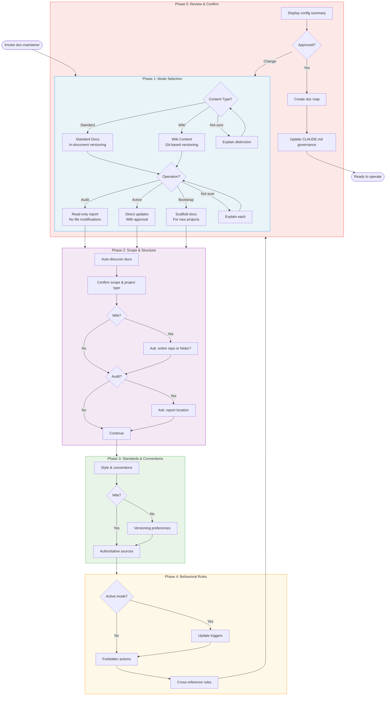
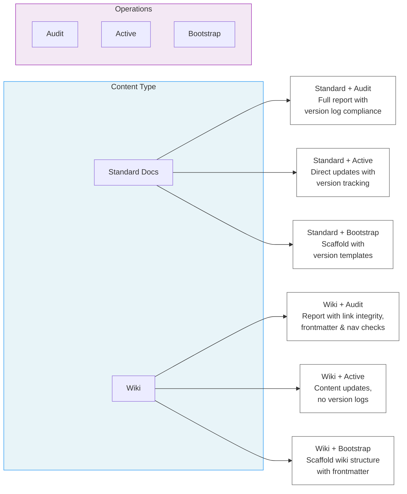

# Claude Plugin Marketplace

A curated collection of specialized agent plugins for Claude Code that extend capabilities with domain-specific workflows and behaviors.

## What are Claude Plugins?

Claude Plugins are specialized agent specifications that define focused behaviors for specific tasks like documentation maintenance, code review, testing, and more. They work alongside the main Claude Code agent via the Task tool.

## Quick Start

### Add the Marketplace (One Command!)

```bash
/plugin marketplace add Piscatore/claude-plugin-marketplace
```

This connects your Claude Code instance to the marketplace.

### Browse and Install Plugins

```bash
/plugin marketplace list                    # List all marketplaces
/plugin list                                # List all available plugins
/plugin install piscatore-agent-plugins:doc-maintainer  # Install a plugin
```

### Manual Installation

1. Clone this repository
2. Copy desired plugin directories from `plugins/` to your project's `.claude/context/plugins/` directory
3. Restart Claude Code or reload context

## Available Plugins

| Plugin ID | Name | Version | Category | Description |
|-----------|------|---------|----------|-------------|
| doc-maintainer | Documentation Maintainer | 1.10.0 | productivity | Specialized agent for documentation auditing, maintenance, and bootstrapping. Supports standard and wiki content types with audit, active, and bootstrap operations. Interview-based onboarding. |
| doc-pr-reviewer | Documentation PR Reviewer | 1.1.0 | productivity | Reviews Pull Requests for documentation compliance. Supports advisory, strict, and auto-fix modes with web search. |

Use `/plugin show <id>` for detailed information about each plugin.

### doc-maintainer Onboarding Interview

When you first invoke doc-maintainer on a project, it conducts a step-by-step interview to understand your setup. The same interview flow is used for subsequent configuration changes (only affected settings are re-asked).



### doc-maintainer Content Type + Operation Matrix



### Operating Modes

doc-maintainer uses a two-axis model: **content type** (Standard or Wiki) combined with an **operation** (Audit, Active, or Bootstrap). Within active mode there are additional sub-modes: Update Request, Proactive Monitoring, Consistency Audit, and Temporal Entry. See [agent.md](doc-maintainer/agents/agent.md) for full mode details.

**Quick usage:**

```bash
# Standard + audit
Use doc-maintainer to audit my documentation

# Standard + active maintenance
Use doc-maintainer in active mode to update the API docs

# Wiki + active (entire repo)
Use doc-maintainer on this repository with wiki content type

# Wiki + active (scoped to folder)
Use doc-maintainer with wiki content type, scoped to the wiki/ folder

# Wiki + audit
Use doc-maintainer to audit my wiki documentation
```

## Plugin Structure

Each plugin is a markdown specification file that defines:

- **Core Responsibilities** - What the agent does
- **Operating Modes** - Different modes of operation
- **Workflows** - Step-by-step processes for scenarios
- **Tool Usage Guidelines** - How to use Claude Code tools
- **Anti-Patterns** - What NOT to do
- **Example Interactions** - Reference examples

## Contributing Plugins

To add a new plugin to the marketplace:

1. Create plugin directory structure:
   ```
   your-plugin-id/
   ├── plugin.json
   └── agents/
       └── your-agent.md
   ```

2. Create `plugin.json`:
   ```json
   {
     "name": "your-plugin-id",
     "version": "1.0.0",
     "description": "Brief description of your plugin",
     "author": "Your Name",
     "agents": ["./agents/"]
   }
   ```

3. Add plugin to `.claude-plugin/marketplace.json`:
   ```json
   {
     "name": "your-plugin-id",
     "source": "your-plugin-id",
     "description": "Brief description",
     "version": "1.0.0",
     "author": { "name": "Your Name", "email": "you@example.com" },
     "keywords": ["tag1", "tag2"],
     "strict": false
   }
   ```

4. Commit and push

## Plugin Categories

- **productivity** - Tools for improving development workflow and efficiency
- **code-quality** - Tools for code review, testing, and quality assurance
- **documentation** - Tools for managing and maintaining documentation
- **security** - Tools for security analysis and vulnerability detection
- **devops** - Tools for deployment, CI/CD, and infrastructure

## Using Plugins in Claude Code

Once installed, reference plugins in your conversations:

```
User: "Use the doc-maintainer plugin to audit my documentation"
Claude: [Loads and follows the doc-maintainer plugin specification]
```

Or use the Task tool to delegate to specialized agents:

```python
# In Claude Code
Task(
    subagent_type="doc-maintainer",
    prompt="Run a consistency audit on the documentation"
)
```

## Repository Structure

```
claude-plugin-marketplace/
├── .claude-plugin/
│   └── marketplace.json       # Marketplace registry (required)
├── doc-maintainer/
│   ├── plugin.json            # Plugin metadata
│   └── agents/
│       └── doc-maintainer.md  # Agent specification (EDIT HERE)
└── README.md
```

## Plugin Development Workflow

When modifying a plugin:

1. **Create branch**: `git checkout -b feature/description`
2. **Edit** the agent spec: `<plugin-id>/agents/<plugin-id>.md`
3. **Update version** in `<plugin-id>/plugin.json`
4. **Commit and push branch**: `git push -u origin feature/description`
5. **Create PR**: `gh pr create`
6. **Review**: Run doc-pr-reviewer on the PR
7. **Merge** after review passes
8. **Update locally**: `/plugin update` or reinstall the plugin

See `CLAUDE.md` for detailed workflow and branch naming conventions.

## Version

Marketplace Version: 1.0.0
Last Updated: 2025-11-28
